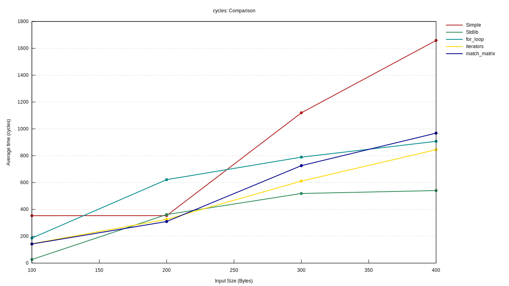
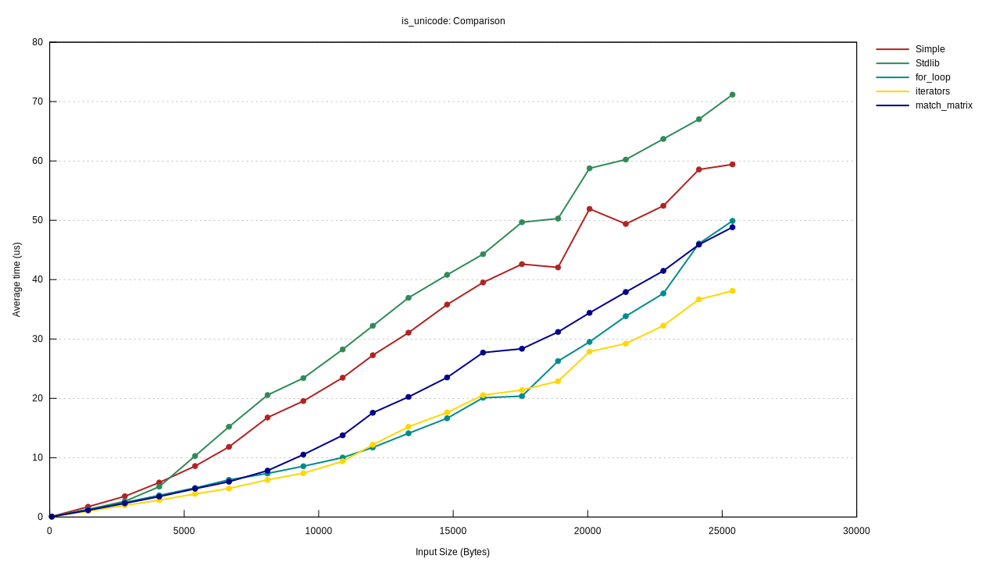

# fast-unicode

This is a collection of algorithms to validate UTF-8 strings. I used these to practice rust.

There currently is:

1. [a simple algorithm ported from C++](./src/simple.rs)
1. [a port of the rust standard library algorithm](./src/stdlib.rs)
1. [the simple algorithm with iterators](./src/iterators.rs)
1. [the simple algorithm with iterators and a iterative lookahead](./src/for_loop.rs)
1. [the simple algorithm with a 'matrix' of matches for the lookahead](./src/simple.rs)

This was also a testbed for experimenting with [Criterion](https://github.com/bheisler/criterion.rs). 
There are [benchmarks here](./benches/is_unicode.rs), and some results:

Total cycles to process a 100 character string with 1, 2, 3 or 4 byte code points. The axis is a bit messed up, but 
`100` means 100 1 byte code points, 200 means 100 2 byte code points and so on:

Total time to process random strings with code points between 1 and 4 bytes long:

